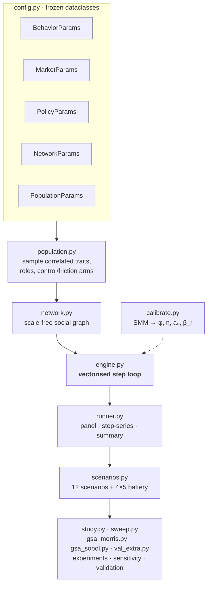
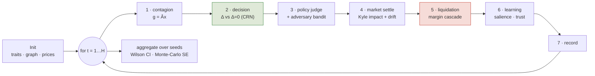
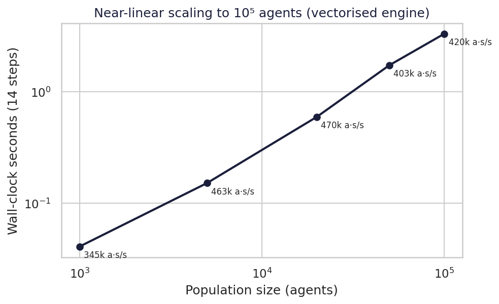
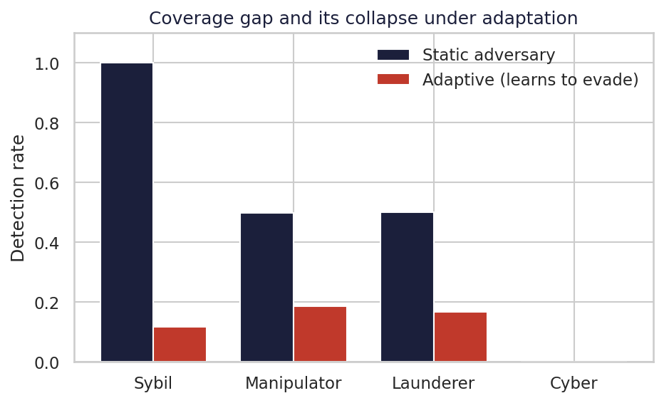
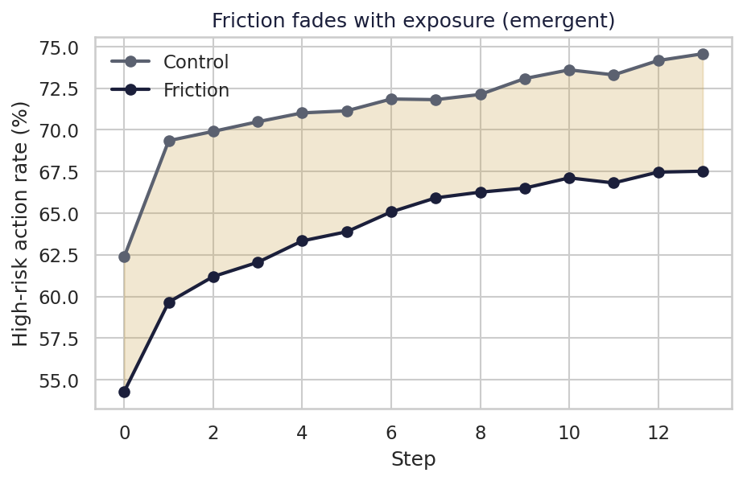
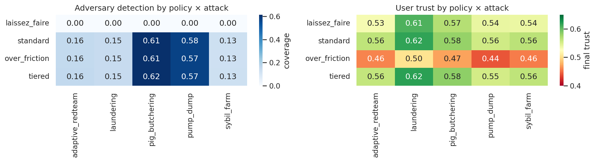
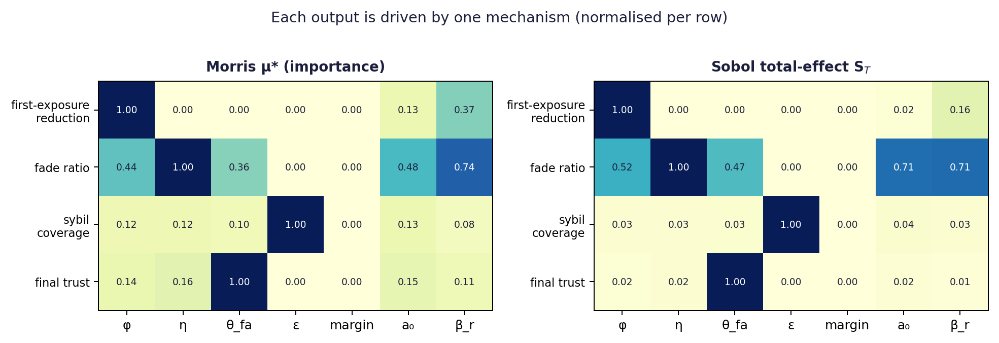
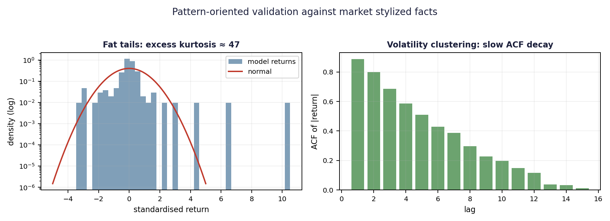

# DFL24-Sim

**An agent-based platform for stress-testing crypto consumer-protection policy.**


DFL24-Sim lets a regulator *try a rule before shipping it*. It couples a calibrated
behavioural model of retail traders to an endogenous market, a compliance engine that
mirrors a production policy, and adversaries that **learn to evade** — then measures what a
proposed intervention actually does, before it ever reaches a real user.

> **Central thesis.** Point-of-action friction (the warning shown at a risky action) is a
> *depreciating, evadable* instrument: its first-exposure effect is real but **fades** as
> users habituate, and the rule-based surveillance it works beside has a **coverage gap**
> that adaptive adversaries widen — so protection cannot be bought by tuning friction alone.

Built for the **Danang Fintech Lab (DFL24)** Sandbox 2.0 programme — 1 of 12 founding
members of VIFC Da Nang. Full write-up in [`DFL24-Sim_WhitePaper.pdf`](./DFL24-Sim_WhitePaper.pdf).

---

## What it produces

| # | Deliverable | Where |
|---|-------------|-------|
| 1 | A calibrated effect size for point-of-action friction (~14%, fading) | §6.3 |
| 2 | A coverage map of where rule-based surveillance fails (9–19% vs adaptive adversaries) | §6.2 |
| 3 | A policy recommendation: deploy *standard/tiered*, never *over-friction* | §6.6 |
| 4 | A pre-registerable field-experiment design (hypotheses, effect sizes, failure modes) | §8 |

Every number is a **simulation result, not a field measurement** — the platform exists to
make a subsequent field experiment cheaper and pre-registered, not to replace it.

---

## Use it from a chat client

The simulator is also an [MCP](https://modelcontextprotocol.io) server, so a policy analyst
can ask a question in plain language and have the model run it — cite a paper number, run a
scenario in seconds, or trigger the full study as a background job.

- **[Connect via Claude](docs/CONNECT-CLAUDE.md)** — the primary path: add the custom
  connector, sign in, and follow a worked example (coverage gap → scenario → study → figure).
- **[Connect via ChatGPT (Developer Mode)](docs/CONNECT-CHATGPT.md)** — the secondary path,
  with an honest note on its limitations.
- **[Deploy it yourself](docs/DEPLOY.md)** — production VPS runbook (compose, Caddy TLS,
  backups) for operators standing up the server.

---

## Architecture



## The simulation loop

Each step runs **seven vectorised stages** over the whole population. The decision stage
evaluates each agent **twice under common random numbers** — with the friction prompt and
without — so the causal effect is identified per agent, free of between-arm noise.



---

## Install

```bash
git clone https://github.com/dfl24/dfl24sim.git
cd dfl24sim
pip install -e ".[dev]"      # editable install + pytest
```

Requires Python 3.11+. Core deps: `numpy`, `scipy`, `pandas`, `pyarrow`, `matplotlib`
(+ `SALib` for the global sensitivity analysis).

## Quickstart

```bash
# one simulation (100k agents in ~3s)
python -m dfl24sim.cli run --n 100000 --steps 14 --seed 0

# list the twelve scenarios
python -m dfl24sim.cli scenario --list

# run one scenario across seeds
python -m dfl24sim.cli scenario --name C1_pig_butchering_wave --n 15000 --seeds 4

# the full policy × attack study (writes CSVs + figures)
python -m dfl24sim.cli study --out results/

# performance benchmark and SMM calibration
python -m dfl24sim.cli benchmark
python -m dfl24sim.cli calibrate
```

In Python:

```python
from dfl24sim import SimConfig, run
out = run(SimConfig(n_agents=20000, steps=14, seed=0, adaptive_adversary=True))
print(out["summary"]["friction_precision"], out["summary"]["detection_counts_by_role"])
```

---

## Results at a glance

**Performance** — ~470k agent-steps/sec, near-linear to 100k agents.



**The coverage gap** — rule-based detection collapses to 9–19% once adversaries adapt; the
cyber class is never caught.



**Friction fades** — the first-exposure reduction (~14%) erodes as the prompt habituates.
The fade is *emergent*: it vanishes when habituation is switched off.



**Policy × attack battery** — `over-friction` matches `standard` on coverage but destroys
trust (red row): it is a **dominated** policy.



**Global sensitivity (Morris + Sobol)** — each output is driven by one mechanism, with no
cross-leakage: efficacy ← φ, fade ← η, coverage ← ε, trust ← θ_fa.



**Pattern-oriented validation** — the market reproduces stylized facts it was never fitted
to: fat tails (excess kurtosis ≈ 47) and volatility clustering.



---

## The twelve scenarios

| Family | Scenario | Question |
|--------|----------|----------|
| Market | `A1_calm_baseline` | Reference: friction & coverage in a normal market |
| Market | `A2_retail_mania` | Does friction survive euphoria; how far does leverage build? |
| Market | `A3_crash_cascade` | Liquidation cascade: how many burn, how far does trust fall? |
| Market | `A4_exogenous_shock` | Resilience to a depeg-style shock |
| Adversary | `B1_pump_and_dump_ring` | Catch a thin-liquidity pump? Does friction shield chasers? |
| Adversary | `B2_sybil_airdrop_farm` | Sybil detection, and its collapse under adaptation |
| Adversary | `B3_laundering_layering` | Layering caught when launderers adapt? |
| Adversary | `B4_adaptive_red_team` | Worst case: every adversary learns |
| Social-eng | `C1_pig_butchering_wave` | Can friction stop a groomed payment? |
| Policy | `D1_laissez_faire` | Counterfactual floor: no friction, no compliance |
| Policy | `D2_over_friction_fatigue` | Does over-friction backfire via false positives? |
| Policy | `D3_vifc_tiered_sandbox` | Which tiering balances protection vs trust cost? |

---

## Module map

| Module | Responsibility |
|--------|----------------|
| `config.py` | Frozen parameter dataclasses (behaviour, market, policy, network, population) |
| `population.py` | Trait sampling, role/arm assignment |
| `network.py` | Scale-free graph with homophily and influencer hubs |
| `behavior.py` | Dual-process valuation; friction as an attention boost |
| `market.py` | Kyle-impact price book, leverage, liquidation, shocks |
| `policy.py` | Compliance rules; competence gating; AML flags |
| `engine.py` | The vectorised seven-stage step loop |
| `runner.py` | Single-run orchestration and summary |
| `scenarios.py` | The 12 scenarios, the 4×5 battery, scenario metrics |
| `calibrate.py` | Simulated Method of Moments calibration |
| `study.py` | End-to-end experiment driver (CSVs + figures) |
| `sweep.py` | One-at-a-time robustness sweeps |
| `gsa_morris.py` / `gsa_sobol.py` | Global sensitivity (Morris screening, Sobol indices) |
| `val_extra.py` | Stylized-fact validation, MC convergence, adversary bound |

---

## Tests & reproducibility

```bash
pytest -q                     # full suite (seconds)
pytest tests/test_policy.py   # one subsystem
```

Tests are split by subsystem (`tests/test_behavior.py`, `test_market.py`, `test_policy.py`,
`test_network.py`, `test_scenarios.py`); see [`tests/README.md`](tests/README.md) for how to
add one. CI runs the suite on Python 3.11 and 3.12 via GitHub Actions.

To reproduce the paper end-to-end:

```bash
python -m dfl24sim.cli calibrate        # → results/calibration.json
python -m dfl24sim.cli study --out results/
python sweep.py                         # → results/sensitivity/
python gsa_morris.py && python gsa_sobol.py && python val_extra.py   # → results/gsa/
```

Every run writes a configuration-hashed manifest, so any figure traces to the exact
parameters that produced it.

---

## Citation

```bibtex
@techreport{dfl24sim2026,
  title  = {DFL24-Sim: An Agent-Based Platform for Stress-Testing
            Crypto Consumer-Protection Policy},
  author = {{Danang Fintech Lab (DFL24)}},
  year   = {2026},
  note   = {Working paper, Sandbox 2.0 Research},
  url    = {https://github.com/dfl24/dfl24sim}
}
```

**License:** MIT. Built by Danang Fintech Lab (DFL24) · [dfl24.com](https://dfl24.com)
